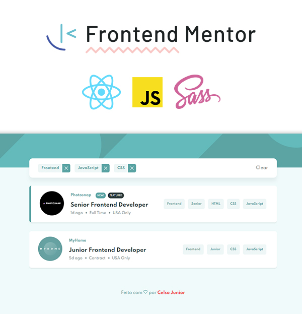

<p align="center" width="100%">
    
</p>

<p width="100%" align="center">
<a href="https://www.linkedin.com/in/celso-junior/">

</a>


</p>

## O Desafio :rocket:

Frontend Mentor é uma plataforma onde existem varios desafios para construção de interfaces, é uma ótima ferramenta para estudo, principalmente para aprimorar o desenvolvimento de layouts e dependendo do desafio, é necessário também integrações com APIs ou manipulação de dados estáticos.

Esse foi um projeto simples, porém com um desafio de manipular **listas**, utilizando as várias features presentes no **Array** do JS.

Projeto online: [Acesse Aqui!](https://clsjunnior.github.io/job-listings-frontendmentor/)

Frontend Mentor: [Link do desafio](https://www.frontendmentor.io/solutions/job-listings-with-filtering-reactjs-sI0z40g-f)

## Instruções

Instalação

```bash
npm install
# or
yarn
```

Iniciando a aplicação

```bash
npm run start
# or
yarn start
```

### Documentações

- [Arrays](https://developer.mozilla.org/pt-BR/docs/Web/JavaScript/Reference/Global_Objects/Array/from)
- [ReactJs](https://pt-br.reactjs.org/)
- [Sass](https://sass-lang.com/)
